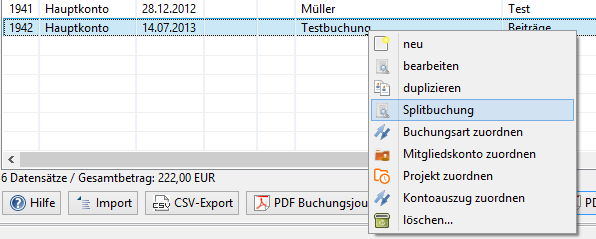
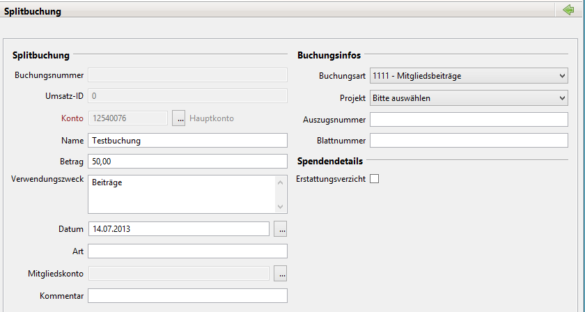
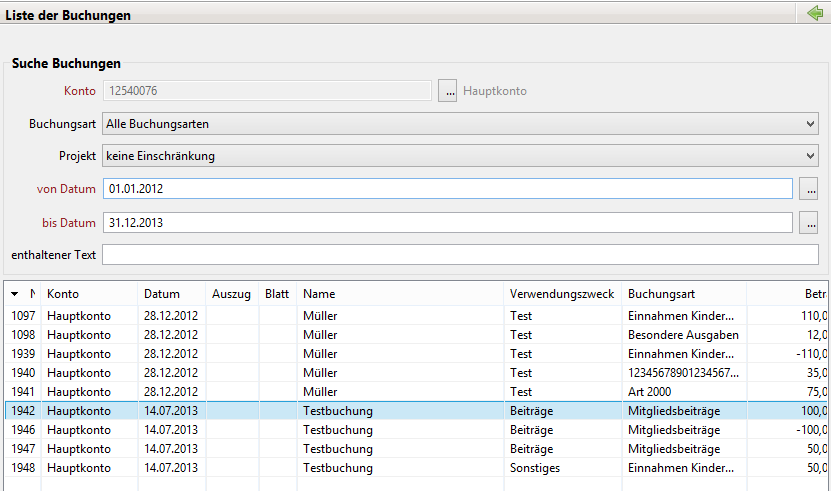
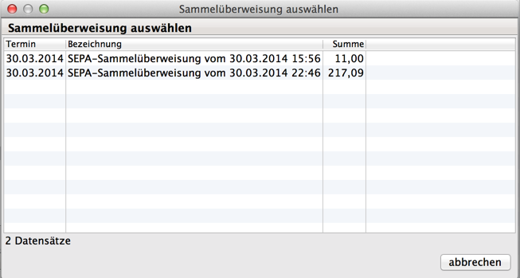

# Splitbuchungen

## Allgemeines

Wofür werden Splitbuchungen gebraucht?

Beispiele:

* Ein Mitglied überweist für mehrere Familienmitglieder den Beitrag in einer Summe. Die Buchung muss für jedes Familienmitglied aufgesplittet werden, damit die Gutschrift für das jeweilige Mitgliedskonto erfolgen kann.
* Der Kassierer überweist einen Gesamtbetrag, der aus buchungstechnischen Gründen auf verschiedene Buchungsarten verteilt werden soll.
* Der Kassierer erzeugt Sammelüberweisungen, deren Einzelposten er auf verschiedene Buchungsarten verteilen muss.

## Splitbuchung erzeugen

Rechtsklick auf die Buchung, dann Splitbuchung auswählen:

Es erscheint dann:

Die angeklickte Buchung erscheint in der ersten Zeile. In der zweiten Zeile erscheint die Gegenbuchung mit umgekehrtem Vorzeichen beim Betrag.

Jetzt können über den "Neu"-Knopf die Splitbuchungen eingegeben werden:Die Splitbuchungen können nur gespeichert werden, wenn

* Haupt- und Gegenbuchung den gleichen Betrag haben, unabhängig vom Vorzeichen.
* Die Summe der Splitbuchungen muss identisch mit dem Betrag der Hauptbuchung übereinstimmen.
* Die Buchungsart bei der Haupt- und der Gegenbuchung muss identisch sein.
* Jede Buchung muss eine Buchungsart haben.

So können die Buchungen gespeichert werden:

## Anzeige der Buchungen

Die Splitbuchungen werden in der Liste der Buchungen "normal" angezeigt. Ein Doppelklick auf eine Haupt-, Gegen- oder Splitbuchung öffnet den Splitbuchungsdialog.

## Sammelüberweisung

Mit einem Klick auf Sammelüberweisung erscheint folgendes Fenster:

Es werden die in Hibiscus vorhandenen Sammelüberweisungen angezeigt. Mit einem Doppelklick auf eine Sammelüberweisung werden die Einzelposten der Sammelüberweisung in die Splitbuchungen übernommen.

## Splitbuchungen auflösen

Sollte versehentlich eine Splitbuchung erzeugt worden sein, kann sie über den Knopf "auflösen" wieder aufgelöst werden. Die Gegen- und Splitbuchungen werden gelöscht. Bei der Hauptbuchung wird das Splitbuchungsmerkmal entfernt.

