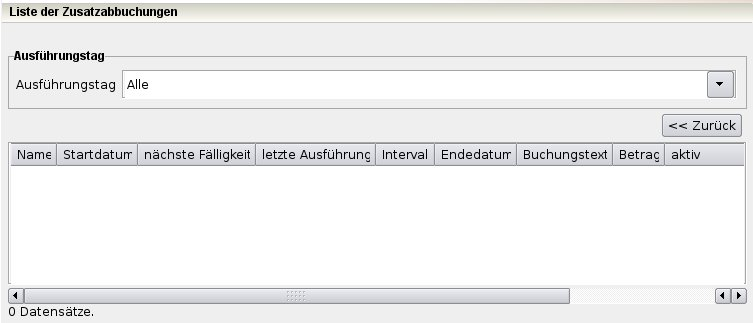
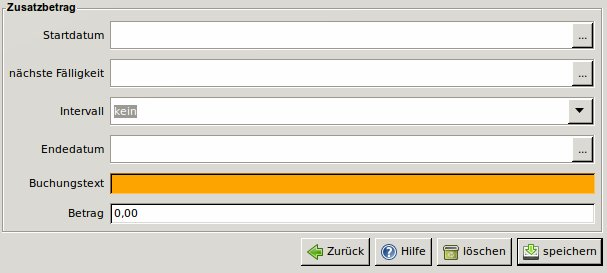

# Zusatzbeträge

Für jedes Mitglied können Zusatzbeträge hinterlegt werden. Diese Beträge werden zusätzlich zum Mitgliedsbeitrag eingezogen. Die Abrechnungen können einmalig \(z. B. Eigenanteil für die Teilnahme an einer Veranstaltung\) oder wiederkehrend \(z. B. Instrumentenversicherung\) angelegt werden. \(Die Zusatzbeträge-Sektionen werden in JVerein nur angezeigt, wenn unter Jameica/JVerein/Administration/Einstellungen/Anzeige der Haken bei "Zusatzbeträge anzeigen" gesetzt ist.\)

Als Wiederholungs-Intervall stehen zur Auswahl:

* monatlich
* zweimonatlich
* vierteljährlich
* halbjährlich
* jährlich

Beim Buchungstext können die allgemeinen Variablen verwendet werden.

Die Zusatzbeträge können sowohl bei jedem Mitglied auf dem entsprechenden Reiter angesehen werden, als auch in einer Übersicht für alle Mitglieder \(Unter Jameica/JVerein/Zusatzbeträge\). Dabei kann die Anzeige eingeschränkt werden auf

* alle Mitglieder
* aktive
* noch nicht ausgeführte Beträge
* nach den verschieden Ausführungsterminen.

Durch einen Doppelklick auf einen Zusatzbetrag wird der Bildschirm für die Bearbeitung geöffnet. Mit einem Rechtsklick öffnet sich ein Menü. Damit kann

* der nächste Fälligkeitstermin gesetzt werden
* der vorherige Fälligkeitstermin gesetzt werden
* das Ausführungsdatum gelöscht werden
* der Zusatzbetrag werden

Bei der Abrechnung finden folgende Prüfungen statt:

* liegt das Fälligkeitsdatum auf dem Endedatum oder danach: Keine Berechnung
* liegt das Fälligkeitsdatum auf dem Stichtagsdatum oder davor: Berechnung. Auf das Fälligkeitsdatum wird das Intervall addiert.

### Beipiel 1

Fälligkeitsdatum: 1.11.2008

Endedatum: 31.10.2008

-&gt; keine Berechnung

### Beispiel 2

Fälligkeitsdatum: 1.11.2008

Endedatum: 31.12.2100

Intervall: Monatlich

Stichtagsdatum: 1.11.2008 -&gt; Berechnung

Anschließend wird das Fälligkeitsdatum auf den 1.12.2008 gesetzt. Am oder nach dem 1.12.2008 findet die nächste Berechnung statt.

Danach wird das Fälligkeitsdatum auf den 1.1.2009 gesetzt.....

## Vorlagen

Bei den Zusatzbeträgen gibt es den Button Vorlagen Damit wird eine Liste der gespeicherten Vorlagen aufgerufen. Mit einem Doppelklick wird eine Vorlage ausgewählt.

Bei der Erfassung von Zusatzbeträgen kann angegeben werden, ob der Zusatzbetrag als Vorlage gespeichert werden soll. Dabei kann angegeben werden, ob Datumsangaben mitgespeichert werden sollen.

