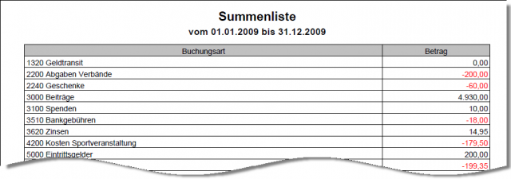
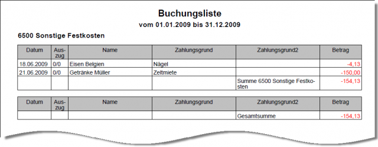

# Buchführung Zusammenhänge

**Unterstützung von JVerein bei den Aufgaben eines Kassenwarts und den Kassenprüfern.**

_Beitrag von Siegfried Kübel_

## Zweck

Da die Aufgaben des Kassenwarts und der Kassenprüfer in einer Vereinssatzung oft nur sehr grob umschrieben werden, es aber dennoch einige Regeln und Vorschriften zu beachten gibt, besteht unter Umständen eine Unsicherheit bei der korrekten Ausführung dieser Tätigkeit.

Will man dann auch noch entscheiden, ob der Wechsel \(oder Neueinsatz\) einer Vereinssoftware wie JVerein sinnvoll und machbar ist, wird die Unsicherheit noch größer.

Erschwerend kommt manchmal hinzu, dass oftmals die Vorstellung eines Buchhalters und eines "Nichtbuchhalters" in puncto Kassenführung sehr unterschiedlich sind, und eine doppelte Buchführung mit einem angepassten "Industriekontenrahmen" für einen "Nichtbuchhalter" nur schwer überblickbar ist.

Deshalb hier eine kurze Beschreibung der Aufgaben eines Kassenwarts und der Kassenprüfer und wie diese Tätigkeiten durch JVerein unterstützt werden können.

Hinweis: Der Autor war selbst über 10 Jahre Kassenwart in einem Musikverein und ist jetzt über 2 Jahre Kassenwart in einem Sportverein und hat somit schon einige Erfahrung auf diesem Gebiet sammeln können.

## Grundlagen

### Aufgaben des Kassenwarts

Oftmals wird in der Vereinssatzung nur sehr knapp die Aufgaben des Kassenwarts beschrieben, z.B. "Die Aufgaben des Kassenwarts erstrecken sich auf die Verwaltung des Vereinsvermögens. Über Einnahmen und Ausgaben ist Buch zu führen". Diese Beschreibung ist zwar richtig, jedoch wird damit nicht ansatzweise beschrieben, nach welchen Gesetzen und Verordnungen das zu geschehen hat.

Sicher ist damit nur, dass man "Buch zu führen hat", und das bedeutet dass man chronologisch, systematisch, lückenlos und ordnungsgemäß alle in Zahlenwerten festgehaltenen, wirtschaftlich bedeutsamen Vorgänge \(Geschäftsvorfälle\) verzeichnen muss.

Wichtig zu wissen ist, dass sich diese Tätigkeit an das HGB anlehnt, und dabei sind vor allem der § 243 \(Aufstellungsgrundsatz\) und der § 246 \(Vollständigkeit. Verrechnungsverbot\) zu nennen.

Mit diesem Wissen ergeben sich folgende Aufgaben und Grundsätze, die eingehalten werden müssen:

1. Im allgemeinen kann die Verwaltung der Kasse mit einer einfachen "Einnahmen-Ausgaben-Rechnung" erfolgen, und es muss keine doppelte Buchführung erstellt werden.
2. Der Jahresabschluss ist nach den Grundsätzen ordentlicher Buchführung \(GOB\) aufzustellen.
   1. Klarheit und Übersichtlichkeit
   2. Vollständigkeit und Richtigkeit
3. Es gilt der Grundsatz der "Klarheit und Übersichtlichkeit" \(§ 243 HGB\), das bedeutet die Nachvollziehbarkeit jeder Buchung aber auch des Jahresabschlusses.
4. Es gilt der "Grundsatz der Vollständigkeit" \(§ 246 HGB\), dies bedeutet dass alle Einnahmen, Ausgaben, Belege, Buchungen vorhanden sein müssen und dass keine Einnahmen mit Ausnahmen verrechnet werden dürfen.
5. Zu guter Letzt hat der Kassenwart eine Auskunfts- und Informationspflicht gegenüber dem Vorstand \(und auch dem Finanzamt\). Dies beinhaltet z.B. Auskunft über die finanzielle Situation aber auch Detailauskünfte z.B. für eine Entscheidung in der Vorstandsschaft.

### Aufgaben des Kassenprüfers

Auch die Aufgabe der Kassenprüfer wird in der Vereinssatzung oft nur sehr grob beschrieben, z.B. mit folgendem Wortlaut: "Die Kassenprüfer sind verpflichtet alle Unterlagen des Kassenwarts zu überprüfen".

Da jedoch der Kassenwart einige Regeln zu beachten hat \(siehe vorheriges Kapitel\) ist es natürlich sinnvoll, dass diese Punkte von den Kassenprüfern auch überprüft werden. Zusätzlich sollte aber auch die sachliche Richtigkeit überprüft werden, wie z.B. die Gruppierung der Einnahmen bzw. Ausgaben \(siehe Kapitel "Buchungsklassen"\). Damit ergeben sich zumindest folgende wichtigen Aufgaben:

1. Überprüfung des Jahresabschlusses auf Richtigkeit, z.B. stimmen die Anfangs- und Endwerte mit den Salden in den Kontoauszügen überein?
2. Überprüfung der Nachvollziehbarkeit und Übersichtlichkeit, z.B. kann jede Buchung nachvollzogen werden?
3. Überprüfung auf Vollständigkeit, z.B. sind alle Belege vorhanden, alle Einnahmen und Ausgaben verbucht und gehören diese auch in das entsprechende Geschäftsjahr?
4. Überprüfung auf sachliche Richtigkeit, z.B. sind die Buchungen richtig den einzelnen "Gruppen" zugeordnet, z.B. nur Spenden sind in der Gruppe "Spende" verbucht und keine Einnahmen von einer Tombola.

## Listen von JVerein für die Buchführung

In diesem Kapitel werden die einzelnen Listen der Buchführung von JVerein beschrieben und wie diese miteinander den Kassenwart und die Kassenprüfer bei Ihrer Arbeit unterstützen.

Normalerweise werden alle notwendigen Listen erstellt, bevor der Jahresabschluss \(Navigation: Buchführung =&gt; Jahresabschluss\) gemacht wird. Durch den Jahresabschluss wird das Geschäftsjahr endgültig abgeschlossen, dies bedeutet dass keine Änderungen \(z.B. bei Buchungen\) in dem abgeschlossenen Geschäftsjahr mehr möglich sind.

Für die Kassenprüfung werden meist nur die Liste Jahressaldo und die Liste "Buchungsjournal" benötigt, da mit diesen beiden Listen alle Transaktionen und deren sachlichen Zuordnung nachvollzogen werden kann \(eventuell sollte die Liste Buchungsklassen noch bereitgelegt werden, da diese für eine eventuelle Meldung fürs Finanzamt wichtig ist und außerdem damit der Kassenbericht relativ einfach angefertigt werden kann\).

Entsprechend werden die restlichen Listen nur für besondere Fragestellungen benötigt \(z.B. als Grundlage für eine Entscheidung in der Vorstandsschaft\).

### Jahressaldo

Die Liste Jahressaldo \(Navigation: Buchführung =&gt; Jahressaldo\) stellt die Verbindung zu den realen Konten und zum Vorjahr her, sprich es wird für jedes Konto der Anfangsbestand, Einnahmen, Ausgaben, Umbuchungen und Endbestand aufgeführt.

Bf-listejahressaldo.png

Diese Liste stellt entsprechend auch die Basis für die Kassenprüfung dar. Die Anfangsbestände finden sich auf der "Jahressaldo-Liste" des Vorjahres wieder und können damit verglichen werden. Die Endbestände der Bankkonten können mit den entsprechenden Kontoauszügen verglichen werden, der Bestand der Kasse wird gezählt.

Somit ist der Jahresendbestand definiert und im nächsten Schritt können die Einnahmen und Ausgaben kontrolliert werden. Dazu dient das Buchungsjournal \(siehe nächstes Kapitel\).

Hinweis: Da auf der "Jahressaldo-Liste" die wichtigsten Zahlenwerte stehen und diese zur nächsten Kassenprüfung im Folgejahr wieder benötigt werden, ist es sinnvoll, am Ende der Kassenprüfung exakt auf dieser Liste die Kassenprüfer mit Unterschrift bestätigen zu lassen, dass die Kasse geprüft wurde und alles in Ordnung ist. Damit ist gewährleistet, dass die Kassenprüfer im Folgejahr auch die richtigen Anfangsbestände verwenden!

### Buchungsjournal

Das "Buchungsjournal" \(Navigation: Buchführung =&gt; Buchungen =&gt; PDF Buchungsjournal\) ist die zentrale Liste mit der die komplette Kasse überprüft werden kann, da die gesamte Arbeit damit abgebildet wird.

Um die Vollständigkeit zu gewährleisten sind nur folgende Selektionen der Buchungen erlaubt, die entsprechend in der Überschrift der Liste erscheinen:

Zeitraum: Für die Kassenprüfung sollte natürlich dann das komplette Geschäftsjahr \(meist das Kalenderjahr\) selektiert werden. Einzelnes Konto oder alle Konten: Diese Selektion hängt von der Arbeitsweise ab, entweder man hat nur ein Ordner mit Belegen \(dann sollte entsprechend auch alle Konten selektiert werden\) oder man hat einen Belegordner pro Konto, dann sollten entsprechend für jedes Konto ein eigenes Buchungsjournal selektiert werden.

Die Sortierung erfolgt grundsätzlich nach Datum, da die Belege im Belegordner normalerweise auch nach Datum sortiert werden \(Hinweis: Die Buchungsnummer erlaubt meist keine sinnvolle Sortierung, da oftmals die Belege erst verspätet beim Kassenwart abgeliefert werden und somit nachträglich \(allerdings mit dem richtigen Datum\) gebucht werden.

Für die Nachvollziehbarkeit und sachlicher Zuordnung \(die die Kassenprüfer normalerweise auch überprüfen sollten\) sind folgende Felder im Buchungsjournal enthalten:

Buchungsnummer \(Nr\) Dient zur Zuordnung der Belege zur Buchung indem jeder Beleg mit der entsprechenden Buchungsnummer beschriftet wird \(= Belegnummer\).

Hinweis: Gerade die Kassenprüfer sind dankbar, wenn sie anhand einer eindeutigen Nummer den relevanten Beleg im Ordner schnell finden können.

| Datum | Ist das Sortierkriterium |
| :--- | :--- |
| Konto und Auszug | Damit kann schnell die Transaktion auf dem entsprechenden Kontoauszug gefunden werden |
| Name und Zahlungsgrund | Beschreiben inhaltlich die Buchung |
| Buchungsart | Stellt die sachliche Zuordnung der Buchung zu einer übergeordneten Gruppe dar \(z.B. dürfen Einnahmen aus einer Tombola nicht plötzlich als Spenden gebucht werden\). Dies ist auch für die Nachvollziehbarkeit fürs Finanzamt wichtig \(siehe Kapitel "Buchungsklassen"\). |
| Betrag | Der Betrag wird nach Ausgaben und Einnahmen unterschieden, um die Salden ermitteln zu können. |

Am Ende der Liste stehen die Summen für Einnahmen, Ausgaben und Umbuchungen. Diese Summen müssen exakt mit den Werten für Einnahmen, Ausgaben und Umbuchungen im Jahressaldo übereinstimmen. Somit wird die Vollständigkeit der Buchungen und damit auch der Belege gewährleistet, da alle Transaktionen im Geschäftsjahr nachgewiesen werden.

### Buchungsartenliste \(Summen\)

Die "Buchungsartenliste-Summen" \(Navigation: Buchführung =&gt; Buchungen =&gt; PDF Summen\) dient dazu einen Gesamtüberblick über die finanzielle Situation zu erhalten, um z.B. einen Kassenbericht anzufertigen.

Entsprechend wird auch am Ende dieser Liste die Summen getrennt nach Einnahmen, Ausgaben und Umbuchungen aufgeführt. 

### Buchungsartenliste \(Einzelbuchungen\)

Die "Buchungsartenliste-Einzelbuchungen" \(Navigation: Buchführung =&gt; Buchungen =&gt; PDF Einzelbuchungen\) dient für die Klärung einer Detailfrage, z.B. "Wer hat dieses Jahr schon alles gespendet?" oder "Welche Sportgeräte wurden dieses Jahr schon gekauft?"\).

Deshalb werden entsprechend der Selektion nur die relevanten Buchungen gruppiert nach den Kostenarten und mit den gesamten Informationen \(Name, Zahlungsgrund, Zahlungsgrund2\) dargestellt.

### Buchungsklassenliste

Die Buchungsklassen dienen dazu die einzelnen Buchungen entsprechend den steuerlichen Vorgaben zu gruppieren. Diese Klassen können in JVerein unter "Administration =&gt; Buchungsklasse" angelegt und gepflegt werden.

Für Vereine würde sich folgende Aufteilung anbieten, da diese Gruppierung vom Finanzamt angefragt werden kann, da z.B. für die Steuerbefreiung bestimmte Grenzwerte in diesen Gruppen nicht überschritten werden dürfen:

* Ideeller Bereich
* Vermögensverwaltung
* Zweckbetrieb
* Wirtschaftlicher Geschäftsbetrieb

Unter Administration =&gt; Buchungsart werden die Buchungsarten angelegt und gepflegt. Dort können die Buchungsarten auch den einzelnen Buchungsklassen zugeordnet werden. Wichtig dabei ist natürlich, die Buchungsarten so zu definieren, dass diese auch eindeutig zu einer Buchungsklasse zugeordnet werden können.

Die "Buchungsklassenliste" \(Navigation: Buchführung =&gt; Buchungsklassen\) zeigt nun das Ergebnis dieser Aufteilung für ein Geschäftsjahr an.

Die Vollständigkeit der Liste wird dadurch gewährleistet dass zum einen die Gesamtsummen für Einnahmen und Ausgaben \("Gesamtsaldo" in der zweitletzten Zeile\) exakt den Gesamtsummen im Jahressaldo entsprechen müssen und zweitens eventuelle Buchungen die keiner Kostenart bzw. Kostenarten die keiner Kostenklasse zugeordnet sind \(was nicht sein sollte\) auf dieser Liste gesondert aufgeführt werden.

Die Nachvollziehbarkeit wird dadurch gewährleistet, dass jede Buchung genau einer Kostenart zugeordnet ist und dies im Buchungsjournal aufgeführt wird \(und von den Kassenprüfern hoffentlich kontrolliert wurde\). Somit kann für jede Zeile in der "Buchungsklassenliste" nachvollzogen werden, welche Buchungen im einzelnen zu diesem Wert geführt haben.

